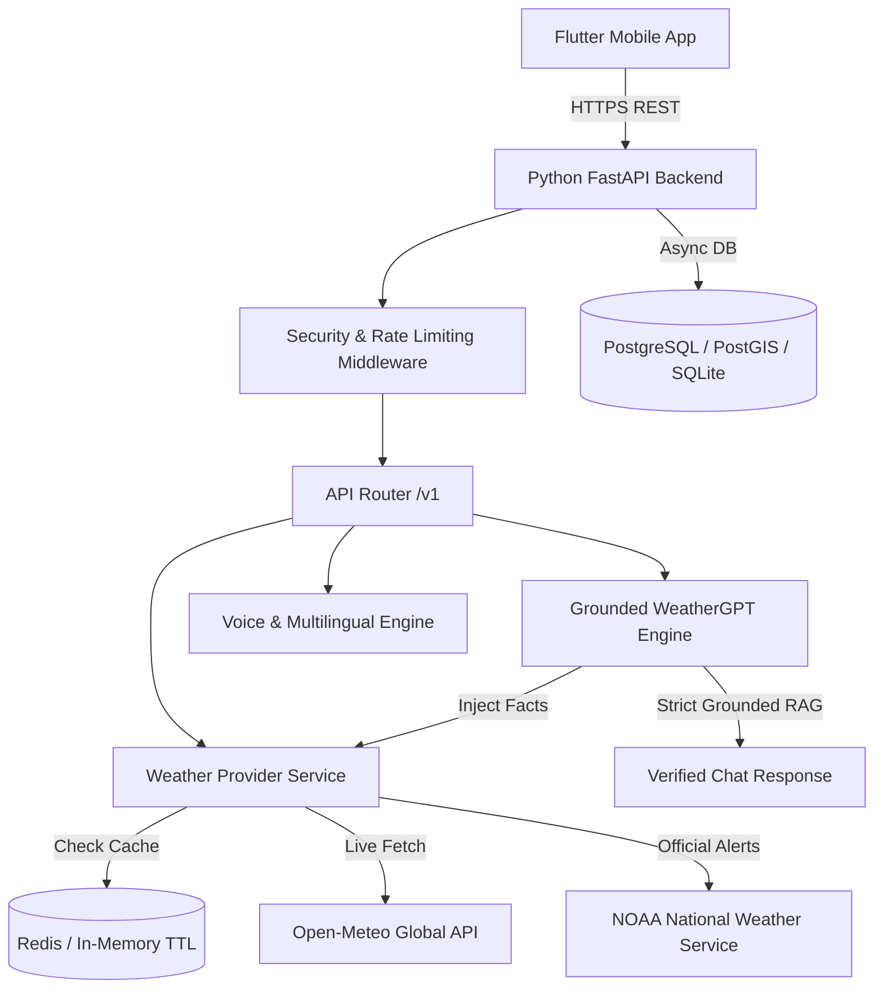

# WeatherGPT System Architecture Specification

## Overview
WeatherGPT is an AI-powered conversational weather intelligence platform designed for mobile deployment. It combines real-time meteorological API data, severe weather warnings, historical climate analysis, and low-bandwidth optimization with zero-hallucination AI conversational guardrails.

---

## Architectural Principles & Security Design

### 1. Grounded Conversational AI Guardrails (Zero Hallucination)
- **Principle**: The LLM is strictly forbidden from inventing weather numbers or forecasts.
- **Implementation**: RAG & Tool Execution pattern.
  1. The backend parses user intent (location, timeframe, metric/imperial preference).
  2. The `WeatherProviderService` retrieves verified weather facts from trusted meteorological data sources (Open-Meteo API, NOAA NWS, WMO).
  3. Grounded facts are passed directly into the prompt context with strict system instructions: *"Synthesize your response using ONLY the provided verified facts. Never fabricate temperature or precipitation numbers."*
  4. Each response explicitly returns a list of `grounded_facts` with source attribution.

### 2. Official Warnings vs AI Recommendations Distinction
- **Official Warnings**: Verified government/meteorological agency emergency alerts (NOAA NWS, WMO, National Met Services) marked with `is_official_warning: true` and rendered with high-priority red alert banners.
- **AI Recommendations**: Safety advisories (e.g. clothing recommendations, UV precautions) generated dynamically, clearly tagged as `AI Advisory:` to prevent confusion with official emergency orders.

### 3. Security & Secret Management
- **Zero Hardcoded Secrets**: Secrets and API keys are loaded via Pydantic `BaseSettings` from environment variables (`.env`).
- **Input Sanitization**: All user strings are sanitized using `sanitize_input_text()` to strip script tags and prevent XSS/injection attacks.
- **Untrusted Weather Data Validation**: External weather data payloads pass through `sanitize_weather_data()` to enforce strict numerical boundary limits (temperature [-100°C to +70°C], humidity [0% to 100%], etc.).
- **Log Redaction**: Structured logger (`app/core/logging.py`) automatically redacts API keys, tokens, and passwords.

### 4. Low-Bandwidth & Offline Optimization
- **Low-Bandwidth Mode**:
  - Minified JSON schema (`/api/v1/weather/compact`) reducing payload size by up to ~65%.
  - GZip binary compression.
  - Forecast days capped to 3 days under low connectivity.
- **Offline Access**:
  - Mobile client caching (`OfflineCache`) persists the last valid weather response and severe advisories in local encrypted storage.
  - Automatic fallback when device is disconnected from the network.

---

## System Architecture Diagram

---

## API Endpoint Reference

| Method | Endpoint | Description |
| :--- | :--- | :--- |
| `GET` | `/health` | Service health status |
| `GET` | `/api/v1/weather` | Current weather & daily forecast (supports `low_bandwidth=true`) |
| `GET` | `/api/v1/weather/compact` | Ultra-compressed JSON payload for low-bandwidth environments |
| `POST` | `/api/v1/chat` | Conversational WeatherGPT query with grounded fact verification |
| `GET` | `/api/v1/alerts` | Active official severe weather warnings |
| `POST` | `/api/v1/voice` | Audio Speech-to-Text & synthesized weather query processing |
